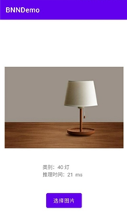

# 基于Bi-Real Net18的图像分类app

## 1. 简介

此处是关于app编写的具体代码，使用了Bi-Real Net18作为网络结构，该网络在CIFAR100数据集上进行训练。通过在手机上选择图片，可以对选择的图片的类别进行判定，并且给出推理时间。

具体的结果如下所示：

## How to run

运行该项目需要安装Android Studio，并在该软件中选择打开BNNDemo文件夹即可。