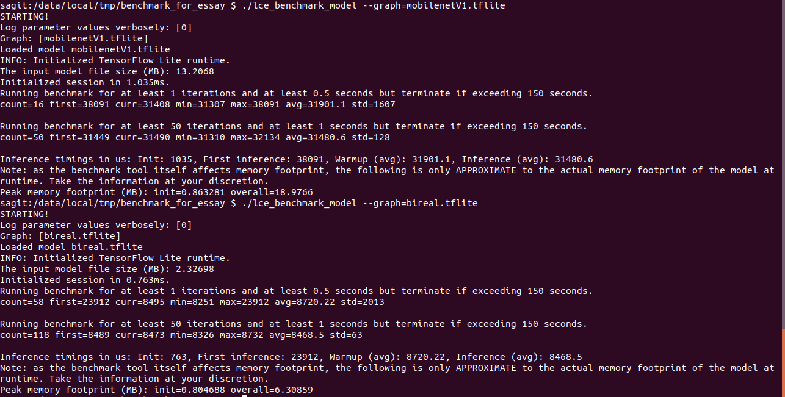

# Benchmark

## 1.简介

此处为对Bi-Real Net18以及MobileNet进行benchmark得到的结果，以此来测试模型的推理速度。

在搭载骁龙835的手机上进行测试，得到的结果如图所示



如图，MobileNetV1的推理速度为31ms左右，Bi-Real Net18的推理速度为8ms左右。

## 2. How to run

运行该benchmark需要准备一台安卓手机，一根USB数据线来将手机连接至电脑，同时电脑需要安装adb(android debug bridge)。

具体的操作流程如下：

1. 将模型推送到测试的手机端

   ```shell
   adb push bireal.tfilte /data/local/tmp/benchmark_for_essay/bireal.tfilte
   adb push mobileNetV1.tfilte /data/local/tmp/benchmark_for_essay/mobileNetV1.tfilte
   ```

2. 将测试文件推送到手机端

   ```shell
   adb push lce_benchmark_model /data/local/tmp/benchmark_for_essay/lce_benchmark_model
   ```

3. 进行测试

   ```shell
   adb shell
   ./lce_benchmark_model --graph=xxx.tfilte
   ```


