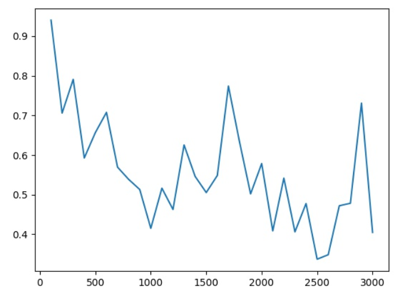
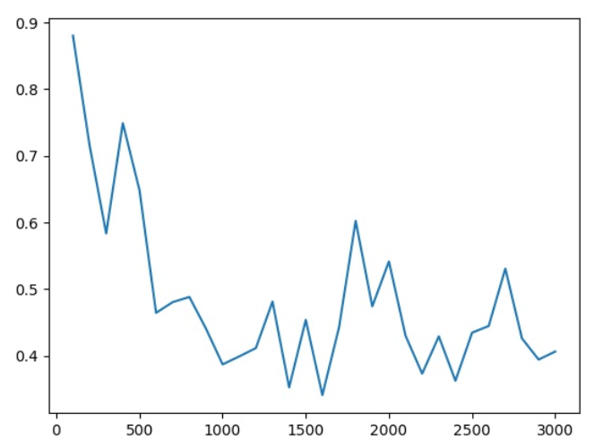
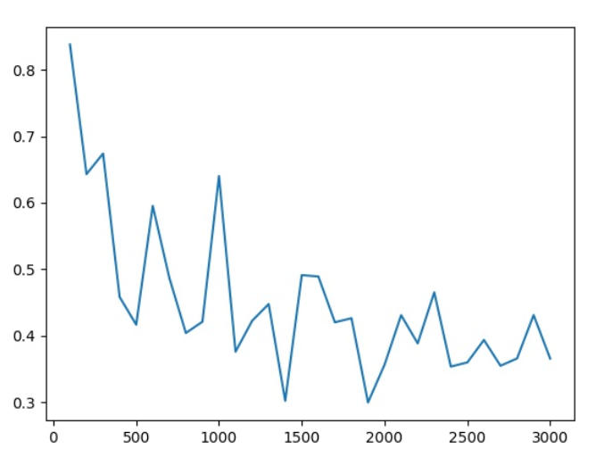

### 在MNIST数据集 使用二值weights的LSTM跑出的结果(epoch均为5)

#### num_layer为1

| hidden_size\learning_rate | 0.001  | 0.01       | 0.1    | 0.5    |
| :-----------------------: | ------ | ---------- | ------ | ------ |
|            20             | 42.35% | 54.92%     | 47.8%  | 13.23% |
|            50             | 54.87% | 68.72%     | 62.98% | 22.37% |
|            100            | 66.76% | 77.8%      | 62.25% | 24.52% |
|            128            | 71.5%  | 78.59%     | 68.38% | 33.34% |
|            256            | 81.33% | **85.37%** | 71.3%  | 33.66% |

hidden_size为256， learning_rate为0.01(对用accuracy为85.37%)时的loss图像如下所示：

#### num_layer为2

| hidden_size\learning_rate | 0.001  | 0.01       | 0.1    | 0.5    |
| :-----------------------: | ------ | ---------- | ------ | ------ |
|            20             | 51.45% | 57.72%     | 51.95% | 36.4%  |
|            50             | 63.21% | 70.97%     | 64.09% | 12.75% |
|            100            | 75.02% | 78.27%     | 70.67% | 17.68% |
|            128            | 77.28% | 83.43%     | 64.33% | 23.54% |
|            256            | 84.75% | **87.55%** | 31.15% | 16.58% |

hidden_size为256， learning_rate为0.01(对用accuracy为87.55%)时的loss图像如下所示：

#### num_layer为3

| hidden_size\learning_rate | 0.001  | 0.01       | 0.1    | 0.5    |
| :-----------------------: | ------ | ---------- | ------ | ------ |
|            20             | 58.96% | 65.71%     | 61.14% | 11.6%  |
|            50             | 69.35% | 73.85%     | 64.7%  | 14.6%  |
|            100            | 79.19% | 83.56%     | 56.71% | 18.6%  |
|            128            | 77.22% | 83.57%     | 36.86% | 12.88% |
|            256            | 85.45% | **87.42%** | 28.79% | 12.43% |

hidden_size为256， learning_rate为0.01(对用accuracy为87.42%)时的loss图像如下所示：

通过三个loss图像可以看出，随着num_layer的增加，loss的波动稍微变小了一点。

根据表格可以看到，learning_rate 在0.01时效果最好，而且hidden_size越大效果越好。

后面还加测了几组数据，当hidden_size为512，num_layer为3，learning_rate为0.01时，epoch为5时能够跑到91%的正确率。

